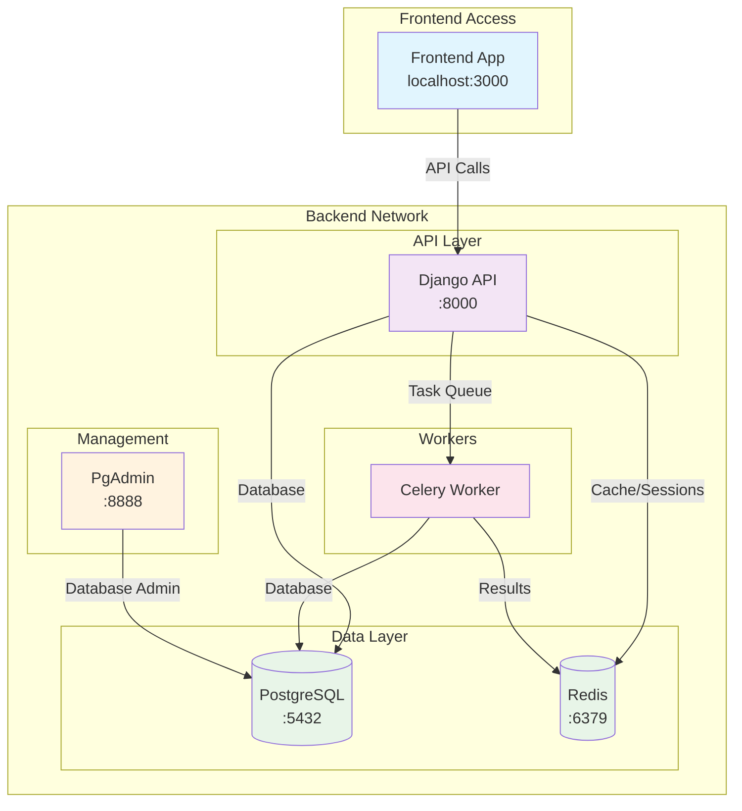

# Backend Services

This document provides essential information about the backend services that support the frontend application. The backend is containerized and runs in an isolated Docker network.

## Quick Start

```bash
# Start all backend services
cd /workspace/backend
docker compose up -d

# Stop all services
docker compose down

# View logs
docker compose logs -f
```

## Service Details

| Service        | Port | Purpose                | Access                  |
| -------------- | ---- | ---------------------- | ----------------------- |
| **Django API** | 8000 | Main API endpoint      | `http://localhost:8000` |
| **PgAdmin**    | 8888 | Database management UI | `http://localhost:8888` |
| **PostgreSQL** | 5432 | Database server        | Internal only           |
| **Redis**      | 6379 | Cache & message broker | Internal only           |
| **Celery**     | -    | Background task worker | Internal only           |

## Credentials

### Database Access

- **Host**: `localhost:5432` (PostgreSQL)
- **Database**: `rota_round`
- **Username**: `rota_user`
- **Password**: `dev_password_123`

### PgAdmin (Database Management)

- **URL**: `http://localhost:8888`
- **Email**: `admin@rota.com`
- **Password**: `admin_password`

### Redis (Cache/Broker)

- **Host**: `localhost:6379`
- **Password**: `dev_redis_password`

## Architecture



## Frontend Integration

### API Endpoint

- **Base URL**: `http://localhost:8000`
- **Authentication**: Django sessions (no JWT in MVP, per PRD)
- **CORS/CSRF**: Configured for SPA on localhost (document trusted origins and CSRF handling)

### Database Testing

If you need direct database access for testing:

- Use PgAdmin at `http://localhost:8888`
- Or connect directly using the PostgreSQL credentials above

### Health Checks

- Django API: `http://localhost:8000/health/` (if implemented)
- PgAdmin: `http://localhost:8888`
- All services have Docker health checks enabled

## Notes

- Backend services run in an isolated Docker network
- Only Django API and PgAdmin are exposed to the frontend
- PostgreSQL and Redis are internal-only for security
- Celery handles background tasks (no direct frontend interaction)
- All services restart automatically unless manually stopped

## Database Initialization (Postgres)

- Place initialization scripts in `backend/init/` (e.g., `00-init.sql`).
- Update `backend/compose.yml` to mount `./init:/docker-entrypoint-initdb.d` for the `postgres` service so scripts run on first container start.
- Recommended: include any required extensions and comments; database/user are already created via environment variables.

## Authentication & Timezone

- Authentication: Django sessions (built-in `contrib.auth`). No JWT in MVP as per PRD.
- Timezone: Default to UTC in backend. Expose `SystemSettings.timezone` to allow change in app settings.
- Python packages managed with `uv` (not pip).

## CSRF & CORS (SPA Dev)

- Authentication uses Django sessions (no JWT in MVP)
- SPA must send requests with `credentials: include` and `X-CSRFToken` for unsafe methods
- Ensure `CSRF_TRUSTED_ORIGINS` includes `http://localhost:8080` and `http://127.0.0.1:8080`
- If using `django-cors-headers`, configure `CORS_ALLOWED_ORIGINS` to include SPA origin and set `CORS_ALLOW_CREDENTIALS=True`

See `docs/csrf-cors.md` for full details and code examples.
