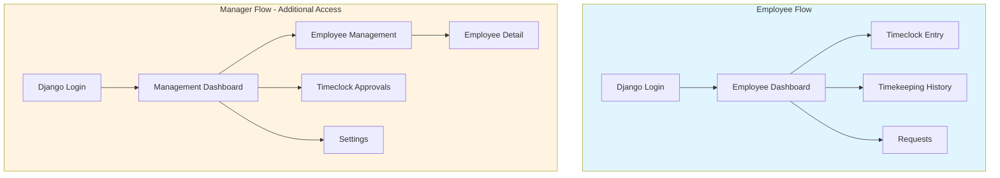

# NI Assembly Dashboard - Product Requirements Document

## Executive Summary

An operational web application for a broadcast facility providing employee time tracking and time-off request management. The system supports 20-30 employees with 3-5 concurrent users, managing holiday, leave, and TOIL (Time Off In Lieu) balances.

**Primary Goal**: Enable timekeeping and time-off management for a single business unit with separate interfaces for employees and managers.

## Architecture

### Frontend

- [Lovable](https://www.lovable.dev) - React-based frontend
- React 18.3.1 with TypeScript 5.8.3
- Vite 5.4.19 (build tool)
- React Router DOM (routing)
- TanStack Query (server state)
- Tailwind CSS + shadcn/ui (styling)
- React Hook Form + Zod (forms/validation)

### Backend

- [Python](https://www.python.org/) version: >=3.12
- [Django](https://www.djangoproject.com/) version: >=5.2
- [Postgres](https://www.postgresql.org/) version: >=18
- [Celery](https://docs.celeryq.dev/) version: >=5.5
- [Docker](https://www.docker.com/)

### Authentication

- Django authentication with session management
- **JWT not required for MVP** - Django sessions are sufficient with React frontend

## Project Structure

### Critical: Directory Organization

The project uses a **frontend subdirectory** structure. All React code MUST be inside the `frontend/` directory:

```
rota-round/
├── frontend/                    # ALL React application code goes here
│   ├── src/
│   │   ├── components/          # React components
│   │   │   ├── dashboard/       # Dashboard-specific components
│   │   │   │   └── BalanceCard.tsx
│   │   │   ├── layout/          # Layout components (Header, Sidebar)
│   │   │   │   ├── Header.tsx
│   │   │   │   └── Sidebar.tsx
│   │   │   └── ui/              # shadcn/ui components
│   │   │       ├── button.tsx
│   │   │       ├── card.tsx
│   │   │       └── ... (all shadcn components)
│   │   ├── contexts/            # React Context providers
│   │   │   └── UserContext.tsx
│   │   ├── hooks/               # Custom React hooks
│   │   │   ├── use-mobile.tsx
│   │   │   └── use-toast.ts
│   │   ├── lib/                 # Utility functions and mock data
│   │   │   ├── mockData.ts      # Mock data for development
│   │   │   └── utils.ts         # Utility functions (cn, etc.)
│   │   ├── pages/               # Page components (route destinations)
│   │   │   ├── EmployeeDashboard.tsx
│   │   │   ├── EmployeeDetail.tsx
│   │   │   ├── EmployeeManagement.tsx
│   │   │   ├── Login.tsx
│   │   │   ├── ManagementDashboard.tsx
│   │   │   ├── NotFound.tsx
│   │   │   ├── Requests.tsx
│   │   │   ├── Settings.tsx
│   │   │   ├── TimeclockApprovals.tsx
│   │   │   ├── TimeclockEntry.tsx
│   │   │   └── TimekeepingHistory.tsx
│   │   ├── App.css              # Root styles
│   │   ├── App.tsx              # Root App component with Router
│   │   ├── index.css            # Global styles and Tailwind
│   │   ├── main.tsx             # React entry point
│   │   └── vite-env.d.ts        # Vite type definitions
│   ├── vite.config.ts           # Vite configuration (defines @ alias)
│   └── README.md                # Frontend-specific README
├── backend/                     # Django backend (to be implemented)
│   ├── compose.yml              # Docker Compose for backend services
│   └── README.md                # Backend-specific README
├── docs/                        # Project documentation
│   └── prd.md                   # This Product Requirements Document
├── memory-bank/                 # Memory Bank for AI context
│   ├── activeContext.md
│   ├── productContext.md
│   ├── projectbrief.md
│   ├── progress.md
│   ├── systemPatterns.md
│   └── techContext.md
├── optimization-journey/        # System optimization docs
├── public/                      # Public static assets
│   ├── robots.txt
│   └── favicon.ico
├── index.html                   # HTML entry point
├── tailwind.config.ts           # Tailwind configuration
├── vite.config.ts               # Root Vite config (proxies to frontend/)
├── package.json                 # NPM dependencies
├── tsconfig.json                # TypeScript configuration
└── README.md                    # Project root README
```

### Import Path Alias Configuration

**CRITICAL**: The `@` alias is configured in `frontend/vite.config.ts` to point to `frontend/src/`:

```typescript
// frontend/vite.config.ts
export default defineConfig({
  resolve: {
    alias: {
      "@": path.resolve(__dirname, "./src"),
    },
  },
})
```

**All imports MUST use the `@` alias** for consistency:

```typescript
// ✅ CORRECT - Use @ alias
import { Button } from "@/components/ui/button";
import { mockEmployees } from "@/lib/mockData";
import { useUser } from "@/contexts/UserContext";

// ❌ WRONG - Don't use relative paths for cross-directory imports
import { Button } from "../../components/ui/button";
import { mockEmployees } from "../lib/mockData.ts";
```

### File Organization Rules

1. **Components**: Place in `frontend/src/components/`
   - UI components (shadcn): `components/ui/`
   - Layout components: `components/layout/`
   - Domain-specific: `components/dashboard/`, `components/timeclock/`, etc.

2. **Pages**: Place in `frontend/src/pages/`
   - Each page is a route destination
   - Named with PascalCase (e.g., `EmployeeDashboard.tsx`)

3. **Utilities**: Place in `frontend/src/lib/`
   - `utils.ts` - Helper functions (cn, formatters, etc.)
   - `mockData.ts` - Mock data for development (until backend ready)

4. **Contexts**: Place in `frontend/src/contexts/`
   - Global state providers (UserContext, ThemeContext, etc.)

5. **Hooks**: Place in `frontend/src/hooks/`
   - Custom React hooks (use-mobile, use-toast, etc.)

### Critical Rules for Implementation

1. **Never create files in `/src/` at project root** - All React code goes in `frontend/src/`

2. **Always use `@` alias for imports** - Never use relative paths like `../lib/mockData.ts`

3. **No `.ts` extensions in imports** - TypeScript resolves automatically
   ```typescript
   // ✅ CORRECT
   import { mockEmployees } from "@/lib/mockData";

   // ❌ WRONG
   import { mockEmployees } from "@/lib/mockData.ts";
   ```

4. **File naming conventions**:
   - Components: PascalCase (`BalanceCard.tsx`)
   - Utilities: camelCase (`utils.ts`, `mockData.ts`)
   - Hooks: kebab-case with 'use' prefix (`use-toast.ts`)

5. **shadcn/ui components**:
   - Always in `frontend/src/components/ui/`
   - Generated via shadcn CLI
   - Can be customized but keep in ui/ directory

## MVP Scope: Core Timekeeping & Requests

**Goal**: Establish complete time tracking and approval workflow with time-off management

**Features**:

- User authentication and role management (Employee/Manager)
- Employee Dashboard with time balances
- Timeclock entry submission and editing
- Timeclock approval workflow
- Request submission (Holiday/Leave/TOIL)
- Request approval workflow
- Employee management (list, detail, balance adjustments)
- Time balance tracking (Holiday, TOIL, OT)
- Settings page (OT calculation, timezone, pay period)
- In-app notifications for managers
- Basic reports (Timecard, Balance)
- Audit logging

**Pages Included**:

- Login
- Employee Dashboard
- Timeclock Entry
- Timekeeping History
- Requests
- Management Dashboard
- Employee Management
- Employee Detail
- Timeclock Approvals
- Settings

**Success Criteria**:

- Employees can submit and edit timeclock entries
- Managers can approve/reject entries and requests
- OT calculations work correctly based on settings
- Time balances update correctly when requests are approved/cancelled
- All data properly audited
- 100% of timeclock entries submitted through system (no paper/spreadsheets)
- All employees and managers actively using the system

**Estimated Complexity**: Medium - Standard CRUD with approval workflows

## User Roles & Permissions

### Employee (User)

- View personal dashboard and time balances
- Submit timeclock entries
- Create and cancel requests (holiday, leave, TOIL)
- Edit own timeclock entries (until approved)
- View personal timekeeping history

### Manager

- All employee permissions
- Access management dashboard
- Approve/reject timeclock entries
- Approve/reject requests (holiday, leave, TOIL)
- View and manage all employee data
- Edit any timeclock entry (including approved)
- Ad hoc adjustment of employee time balances
- Access all reports
- Change user roles (promote/demote employees to/from Manager role via Employee Detail page)

**Role Assignment Process**:

- Managers can change user roles via the Employee Detail page
- Role changes are immediate and logged in audit trail

**TODO**: Define if only certain managers can change roles (e.g., admin-level managers only?) or if all managers have this permission.

## Business Rules

### Overtime Calculation

**Configurable in Settings:**

- OT Calculation Method: Per Day OR Per Week
- OT Week Start Day: Selectable (if weekly calculation)
- OT Threshold Hours: Hours before OT applies
- OT Multiplier: Selectable (1x, 1.5x, 2x)
- OT Payout Method: Paycheck OR TOIL (Time Off In Lieu)

**Note**: Only one OT multiplier applies system-wide. Multiple tier rates (e.g., 1.5x after 8hrs, 2x after 10hrs) are not supported in MVP.

**TODO**:

- Confirm if OT settings can change mid-month and how that affects existing entries

### Holiday & Leave Management

- **Holiday**: Deducted from employee holiday bank, requires approval
- **Leave**: Does not deduct from bank, requires approval, can be post-dated (e.g., sick leave)
- **TOIL**: Only available if TOIL is activated in settings, deducted from TOIL bank, requires approval
- Holiday balances adjusted ad hoc by managers on Employee Detail page
- Cancelled requests return time to appropriate banks

**TOIL Expiration**:

- TOIL balances do not expire automatically
- Managers can manually adjust TOIL balances as needed via Employee Detail page

**TODO**:

- Define standard holiday accrual rate/amount per employee
- Define if different employees can have different holiday entitlements
- Clarify "post-dated leave" approval workflow (approve after it's already taken?)
- Define maximum negative balance allowed (if any) for emergency leave

### Timeclock Entry & Approval

- Employees can submit timeclock entries at any time (no deadline)
- Entries are editable by employee until approved
- After approval, only managers can edit
- Approvals should occur within 1 week of entry
- End-of-month notification sent to managers for unapproved entries

**TODO**:

- Define what happens to entries that remain unapproved past 1 week (escalation? auto-approve?)
- Confirm if there's a cutoff for editing/approving previous months
- Define notification method for the end-of-month reminder

### General Settings

- Timezone: Selectable in settings
- Pay Period: Selectable (currently monthly)
- **Timeclock entries cannot span midnight** - Hard block in UI, entries must be completed within a single day

## Application Structure

### Navigation Flow



**Note**: Managers have access to both Employee and Manager flows.

## Page Specifications

### Employee Pages

#### Login Page

- Standard Django authentication
- Username and password fields
- "Remember me" option
- Password reset link
- Session expires after 4 hours of inactivity

**Password Requirements**:

- Minimum 8 characters
- Must contain both letters and numbers

**TODO**: Define password reset workflow and failed login handling.

#### Employee Dashboard

**Purpose**: Central hub for employee daily operations

**Components**:

- **Time Balances Display**:
  - Holiday balance (hours/days)
  - TOIL balance (hours/days) - if activated
  - OT balance (hours)
  - Leave used (current period)
- **Quick Actions**:
  - "Submit Time Entry" button → Timeclock Entry page
  - "New Request" button → Requests page
- **Recent Activity**:
  - Recent timeclock entries
  - Recent requests and their status

**TODO**:

- Define time balance display format (hours vs days)
- Confirm if "Leave used" should be tracked separately or just for display

#### Timeclock Entry Page

**Purpose**: Submit time worked

**Fields**:

- Date selector (defaults to current date, changeable)
- Start time (24h format)
- End time (24h format)
- Break time (duration in minutes/hours)
- Notes (optional, freeform text describing work performed)

**Calculations**:

- Total hours = (End time - Start time) - Break time
- OT hours calculated based on settings (display on form before submit)

**Behaviors**:

- Form validation: End time must be after start time
- Warn if entry overlaps with existing entry for same date
- Editable by employee until approved

**TODO**:

- Define behavior for multi-day entries (currently assuming single day only)
- Confirm if break time can be multiple breaks or single total
- Define if employees can see OT calculation before submitting

#### Timeclock Detail Page

**Purpose**: View details of a specific timeclock entry

**Display**:

- All entry fields (read-only or editable based on approval status)
- Calculated total hours
- Calculated OT hours
- Approval status (Pending/Approved/Rejected)
- Approver name and approval date (if approved)
- Edit history (who edited, when)

**Actions**:

- Edit button (if not approved and is own entry)
- Delete button (if not approved and is own entry)

**TODO**: Define if deletion is allowed or if entries should be "cancelled" instead (for audit trail).

#### Timekeeping History Page

**Purpose**: View all personal timeclock entries

**Display**:

- Table of recent entries (last 30 days or current pay period)
  - Date
  - Hours worked
  - OT hours
  - Approval status
  - Notes
- Filters: Date range, approval status
- Pagination (20-50 entries per page)

**TODO**: Define default time range and filter options.

#### Requests Page

**Purpose**: Manage holiday, leave, and TOIL requests

**Display**:

- Table of all personal requests
  - Request type (Holiday/Leave/TOIL)
  - Start date
  - End date
  - Duration (hours/days)
  - Status (Pending/Approved/Rejected)
  - Submitted date
  - Approver (if processed)
- Filters: Request type, status, date range

**Actions**:

- "New Request" button → Opens popup form
- "Cancel" button on pending requests (returns time to bank)

**New Request Form (Popup)**:

- Request type: Holiday / Leave / TOIL
- Start date
- End date
- Duration (auto-calculated or manual entry?)
- Notes/reason (optional)
- Display current balance for selected type
- Submit button

**TODO**:

- Define duration calculation (full days only? half days? hours?)
- Define if requests can span multiple pay periods
- Confirm if managers need to provide rejection reasons
- Define minimum/maximum request duration

### Manager Pages

#### Management Dashboard

**Purpose**: Central hub for manager operations

**Components**:

- **Employee Summary**:
  - Total active employees
  - Employees with pending time entries
  - Employees on holiday/leave today
- **Pending Approvals Summary**:
  - Count of pending timeclock entries (with age indicator)
  - Count of pending requests
  - Quick link to approval pages
- **Quick Links**:
  - Employee Management
  - Timeclock Approvals
  - Settings
- **Recent Activity**:
  - Recently approved entries
  - Recently processed requests

#### Employee Management Page

**Purpose**: Overview of all employees

**Display**:

- Table of all employees
  - Name
  - Current OT balance
  - Pending holiday hours
  - Holiday balance
  - TOIL balance (if activated)
  - Active status
- Search/filter by name or status
- Click row → Employee Detail page

**TODO**:

- Define "active status" options (Active/Inactive/On Leave?)
- Define if historical employees should be archived or displayed

#### Employee Detail Page

**Purpose**: Detailed employee information and balance management

**Display**:

- **Personal Information**:
  - Full name
  - Contact information (phone, email, address)
  - Emergency contact name
  - Emergency contact phone
  - Start date
  - Employee ID/number
  - Active status
  - **User Role**: Dropdown selector (Employee / Manager)
- **Time Balances**:
  - Holiday balance with adjustment controls
  - TOIL balance with adjustment controls
  - OT balance (calculated, read-only)
  - Leave taken (current period, read-only)
- **Ad Hoc Adjustment Form**:
  - Balance type (Holiday/TOIL)
  - Adjustment amount (+/-)
  - Reason (required for audit)
  - Submit button

**Actions**:

- Edit employee information (including role assignment)
- Change user role (Employee ↔ Manager)
- View employee's timeclock history
- View employee's requests

**Role Management**:

- Managers can promote employees to Manager role or demote to Employee role
- Role changes take effect immediately
- Role changes are logged in audit trail

**TODO**:

- Define if only certain managers can change roles (e.g., admin-level managers only?)
- Define required vs optional employee fields
- Define if employee can have custom OT settings

#### Event Management Page

**Purpose**: View and manage all events

**Display**:

- Table of all events (upcoming and past)
  - Event name
  - Date/time
  - Location
  - Total shifts
  - Filled shifts
  - Status (Upcoming/In Progress/Completed)
- Filters: Date range, status, location
- Search by event name
- Click row → Event Creation/Edit page

**Actions**:

- "Create New Event" button → Event Creation page

**TODO**:

- Define if past events should be archived after a certain period
- Define event statuses and when they change

#### Event Creation Page

**Purpose**: Create or edit event details and assign shifts

**Event Information Form**:

| Field                   | Type         | Required | Notes            |
| ----------------------- | ------------ | -------- | ---------------- |
| Event Name              | Text         | Yes      | 64 char max      |
| Event Start Date        | Date         | Yes      |                  |
| Event Start Time        | Time (24h)   | Yes      |                  |
| Event End Date          | Date         | Yes      |                  |
| Event End Time          | Time (24h)   | Yes      |                  |
| Event Address 1         | Text         | Yes      | 64 char max      |
| Event Address 2         | Text         | No       | 64 char max      |
| Event Location Phone    | Phone Number | No       |                  |
| Event Room              | Text         | No       | 64 char max      |
| Event POC               | Text         | No       | Point of Contact |
| Event POC Phone         | Phone        | No       |                  |
| Event Company           | Text         | No       | 64 char max      |
| Event Company Address 1 | Text         | No       | 64 char max      |
| Event Company Address 2 | Text         | No       | 64 char max      |
| Setup Date              | Date         | No       |                  |
| Setup Time              | Time (24h)   | No       |                  |
| Tear Down Date          | Date         | No       |                  |
| Tear Down Time          | Time (24h)   | No       |                  |
| Event Description       | Text         | No       | Large text area  |

**Shift Assignment Section**:

- Table of shifts for this event
  - Shift start time
  - Shift end time
  - Assigned employee (dropdown)
  - Optional checkbox
  - Notes (freeform text)
  - Remove shift button
- "Add Shift" button

**Actions**:

- Save event (with or without shifts)
- Cancel

**TODO**:

- Define if setup/teardown should auto-create shifts
- Confirm phone number format/validation
- Define if events can be templates for reuse
- Define if shift times must fall within event times

#### Timeclock Approvals Page

**Purpose**: Approve or reject timeclock entries and requests

**Timeclock Entries Section**:

- Table of pending timeclock entries
  - Employee name
  - Date
  - Event
  - Hours worked
  - OT hours
  - Submitted date
  - Age (days since submitted)
- Bulk selection checkboxes
- "Approve Selected" button
- "Reject Selected" button
- Click row for detail view with individual approve/reject

**Requests Section**:

- Table of pending requests (Holiday/Leave/TOIL)
  - Employee name
  - Request type
  - Start date
  - End date
  - Duration
  - Submitted date
  - Current balance (for employee)
- Click row for detail view with approve/reject
- Individual approve/reject buttons

**TODO**:

- Define if rejection requires a reason/comment
- Define if partial approval is allowed (e.g., approve 3 days of 5 requested)
- Confirm notification method when entries/requests are processed

#### Settings Page

**Purpose**: Configure system-wide settings

**Sections**:

**Overtime Settings**:

- OT Calculation Method: Radio buttons (Per Day / Per Week)
- Week Start Day: Dropdown (if Per Week selected)
- OT Threshold Hours: Number input
- OT Multiplier: Dropdown (1x, 1.5x, 2x)
- OT Payout Method: Radio buttons (Paycheck / TOIL)
- Enable TOIL: Checkbox

**General Settings**:

- Timezone: Dropdown (standard timezone list)
- Pay Period: Dropdown (Weekly / Bi-weekly / Monthly)
- Default Currency: Text input
- Date Format: Dropdown

**Notification Settings**:

- Timeclock approval deadline: Number input (days)
- End of month reminder: Checkbox

**TODO**:

- Define who can access Settings (all managers or admin only?)
- Define if settings changes should be logged for audit
- Confirm if settings changes apply retroactively or only to new entries
- Define complete list of configurable settings

## UI/UX Design & Wireframes

**TODO**: Create wireframes and UI mockups for key pages before development begins

**Priority Pages for Wireframing**:

1. **Employee Dashboard** - Most frequently used page, needs intuitive layout
2. **Timeclock Entry** - Critical user flow, must be simple and quick
3. **Management Dashboard** - Hub for manager workflows
4. **Timeclock Approvals** - Bulk approval interface needs careful UX design
5. **Requests** - Time-off request interface

**Design Considerations**:

- Mobile-first approach for potential future mobile support
- Accessibility compliance (WCAG 2.1 AA minimum)
- Consistent navigation patterns across all pages
- Visual distinction between Employee and Manager interfaces
- Clear feedback for all user actions (success/error states)
- Loading states for async operations
- Responsive design for various screen sizes

**Actions Required**:

- Research and collect examples of similar time tracking interfaces
- Define color scheme and branding guidelines
- Create low-fidelity wireframes for core pages
- User testing with 2-3 target users before final design
- Define component library (buttons, forms, tables, modals, etc.)

**TODO**:

- Find and document 5-10 examples of good time tracking UIs for reference
- Define if custom design system or use existing UI framework (Material UI, Ant Design, etc.)
- Confirm accessibility requirements and compliance level needed
- Define responsive breakpoints (mobile, tablet, desktop)

## Data Models

**⚠️ NOTE: These are PRELIMINARY schema designs subject to change during development.**

### User/Employee Model

```python
# Extends Django's built-in User model
Employee:
    # Django User fields (inherited)
    - username: string (unique)
    - email: string
    - password: hashed string
    - first_name: string
    - last_name: string
    - is_active: boolean

    # Custom employee fields
    - employee_id: string (unique, nullable)
    - role: enum ['EMPLOYEE', 'MANAGER']
    - phone: string (nullable)
    - address_line1: string (nullable)
    - address_line2: string (nullable)
    - city: string (nullable)
    - postal_code: string (nullable)
    - country: string (nullable)
    - emergency_contact_name: string (nullable)
    - emergency_contact_phone: string (nullable)
    - start_date: date (nullable)
    - holiday_balance_hours: decimal (default: 0)
    - toil_balance_hours: decimal (default: 0)
    - created_at: datetime
    - updated_at: datetime
```

**Required Fields**:

- first_name, last_name (name)
- email, phone (basic contact info)

**Optional Fields**:

- All address fields, emergency contact, employee_id, start_date

**TODO**:

- Confirm if we need separate Profile model or extend User
- Define if employee_id should be auto-generated or manual
- Define if we need employment status field (Full-time, Part-time, Contract)

### Timeclock Entry Model

```python
TimeclockEntry:
    - id: integer (primary key)
    - employee: foreign key → Employee
    - entry_date: date
    - start_time: time
    - end_time: time
    - break_minutes: integer (default: 0)
    - notes: text (nullable)
    - total_hours: decimal (calculated)
    - ot_hours: decimal (calculated)
    - status: enum ['PENDING', 'APPROVED', 'REJECTED']
    - approved_by: foreign key → Employee (nullable)
    - approved_at: datetime (nullable)
    - rejection_reason: text (nullable, optional)
    - created_at: datetime
    - updated_at: datetime
    - created_by: foreign key → Employee (for audit)
    - last_modified_by: foreign key → Employee (for audit)

**Note**: Rejection reasons are optional but encouraged for better communication and audit trail.
```

**Constraints**:

- Check: end_time > start_time
- Check: break_minutes >= 0
- **Business rule**: Timeclock entries cannot span midnight (both start_time and end_time must be within same calendar day)
- **Multiple entries per day allowed** (no unique constraint on employee+date) to support split shifts

**Note**: Remove unique constraint on (employee, entry_date) to allow multiple entries per day for split shift scenarios.

**TODO**:

- Define how to handle entries spanning pay periods for calculations
- Define UI/UX for displaying multiple entries per day (single form vs separate entries)

### Request Model

```python
Request:
    - id: integer (primary key)
    - employee: foreign key → Employee
    - request_type: enum ['HOLIDAY', 'LEAVE', 'TOIL']
    - start_date: date
    - end_date: date
    - duration_hours: decimal
    - notes: text (nullable)
    - status: enum ['PENDING', 'APPROVED', 'REJECTED', 'CANCELLED']
    - approved_by: foreign key → Employee (nullable)
    - approved_at: datetime (nullable)
    - rejection_reason: text (nullable, optional)
    - cancelled_at: datetime (nullable)
    - created_at: datetime
    - updated_at: datetime
```

**Note**: Rejection reasons are optional but encouraged for employee communication.

**Business Logic**:

- On approval: Deduct duration_hours from appropriate balance (holiday_balance or toil_balance)
- On cancellation: Return duration_hours to appropriate balance
- Leave type does not affect balances

**Duration Calculation**:

- **Basis**: Calendar days (including weekends)
- **Partial day support**: Yes - requests can be in hours (e.g., 4 hours for half-day)
- Duration stored in hours for precision

**TODO**:

- Define if requests can be modified after submission (or must cancel and resubmit)
- Define common duration presets in UI (half-day = X hours, full day = X hours)

### Balance Adjustment Model

```python
BalanceAdjustment:
    - id: integer (primary key)
    - employee: foreign key → Employee
    - adjustment_type: enum ['HOLIDAY', 'TOIL']
    - amount_hours: decimal (can be negative)
    - reason: text (required)
    - adjusted_by: foreign key → Employee (manager)
    - created_at: datetime
```

**Purpose**: Audit trail for ad-hoc balance adjustments made by managers

**Approval Workflow**:

- Adjustments take effect immediately (no secondary approval required)
- All adjustments are logged with manager ID, reason, and timestamp for audit trail
- Reason field is required to ensure accountability

**TODO**:

- Confirm if this should be separate model or part of audit log

### System Settings Model

```python
SystemSettings:
    - id: integer (primary key, singleton - only one record)
    - ot_calculation_method: enum ['PER_DAY', 'PER_WEEK']
    - ot_week_start_day: integer (0-6, 0=Monday)
    - ot_threshold_hours: decimal
    - ot_multiplier: decimal (1.0, 1.5, 2.0)
    - ot_payout_method: enum ['PAYCHECK', 'TOIL']
    - toil_enabled: boolean
    - timezone: string (e.g., 'America/New_York')
    - pay_period: enum ['WEEKLY', 'BIWEEKLY', 'MONTHLY']
    - currency: string (default: 'USD')
    - date_format: string (default: 'YYYY-MM-DD')
    - timeclock_approval_deadline_days: integer (default: 7)
    - enable_end_of_month_reminder: boolean (default: true)
    - updated_by: foreign key → Employee
    - updated_at: datetime
```

**TODO**:

- Confirm if settings should be versioned (track history)
- Define if different employee groups can have different settings

### Notification Model

```python
Notification:
    - id: integer (primary key)
    - recipient: foreign key → Employee
    - notification_type: enum ['TIMECLOCK_OVERDUE', 'PENDING_REQUEST', 'END_OF_MONTH', 'REQUEST_PROCESSED', 'TIMECLOCK_APPROVED']
    - title: string
    - message: text
    - related_object_type: string (nullable, e.g., 'TimeclockEntry', 'Request')
    - related_object_id: integer (nullable)
    - is_read: boolean (default: false)
    - read_at: datetime (nullable)
    - created_at: datetime
```

**TODO**:

- Define notification priority levels
- Confirm auto-deletion policy for old notifications

### Audit Log Model

```python
AuditLog:
    - id: integer (primary key)
    - user: foreign key → Employee
    - action: enum ['CREATE', 'UPDATE', 'DELETE', 'APPROVE', 'REJECT', 'ROLE_CHANGE', 'LOGIN', 'LOGOUT']
    - model_name: string (e.g., 'TimeclockEntry', 'Employee')
    - object_id: integer
    - changes: JSON (field: {old_value, new_value})
    - ip_address: string (nullable)
    - user_agent: string (nullable)
    - created_at: datetime
```

**Purpose**: Complete audit trail for compliance and debugging

**Key Actions Logged**:

- User role changes (ROLE_CHANGE)
- Balance adjustments (UPDATE on Employee)
- Timeclock approvals/rejections (APPROVE, REJECT)
- Request approvals/rejections (APPROVE, REJECT)
- Settings changes (UPDATE on SystemSettings)
- Login/logout events (LOGIN, LOGOUT)

**TODO**:

- Define retention policy for audit logs
- Confirm if we need separate security audit log

### Entity Relationship Summary

```
Employee (1) ──── (many) TimeclockEntry
Employee (1) ──── (many) Request
Employee (1) ──── (many) BalanceAdjustment [as target]
Employee (1) ──── (many) BalanceAdjustment [as adjuster]
Employee (1) ──── (many) Notification
Employee (1) ──── (many) AuditLog

TimeclockEntry (many) ──── (1) Employee [as approver]
Request (many) ──── (1) Employee [as approver]

SystemSettings (singleton)
```

**TODO**:

- Review and confirm all relationships
- Define cascade delete behaviors (what happens when employee is deleted?)
- Confirm if we need many-to-many relationships anywhere

## Notifications & Alerts

**In-App Notifications for Managers** (MVP):

- Pending timeclock entries older than 7 days
- Pending requests awaiting approval
- End of month unapproved timeclock entries

**TODO**:

- Define notification display location (badge? notification center? banner?)
- Define notification persistence (dismiss? auto-clear when addressed?)
- Define notification priority/sorting
- Plan for future email/SMS notifications (out of scope for MVP but document)

## Reports & Exports

### Required Reports

1. **Monthly Timecard Report**

   - All employees or single employee
   - Date range
   - Shows: Date, Hours, OT, Notes, Total
   - Formats: PDF, Excel, CSV

2. **Holiday/Leave Report**
   - All employees or single employee
   - Shows: Balance, taken, remaining, upcoming approved requests
   - Formats: PDF, Excel, CSV

**Export Functionality**:

- Configurable CSV export for payroll integration
- **Pre-configured templates**: Common formats (ADP, Paychex, generic) available out of box
- **Custom field mapping UI**: Managers can create custom mappings via interface
  - Map system fields to export column names
  - Define column order
  - Save custom templates for reuse
- Scheduled exports (future consideration)

**Report Customization** (Moderate flexibility):

- Users can select employee(s) and date range
- Users can choose which columns to include/exclude
- Users can define sort order
- Fixed grouping and calculations (no custom formulas in MVP)

**TODO**:

- Define exact available columns for each report type
- Define default column selections
- Confirm if reports need custom date ranges or fixed periods (month, quarter, year)

## API Specification (Future Implementation)

**⚠️ NOTE: API is NOT included in MVP. This section documents intended endpoints to ensure backend is built with API compatibility in mind.**

### Overview

- RESTful API following OpenAPI 3.0 specification
- Base URL: `/api/v1/`
- Authentication: JWT tokens OR API keys
- Response format: JSON
- Rate limiting: TBD

**TODO**:

- Define API versioning strategy (URL path vs header)
- Define rate limiting requirements (requests per minute/hour)
- Decide between API keys vs OAuth 2.0
- Define if API should support webhooks for events

### Intended API Endpoints

#### Authentication

```
POST   /api/v1/auth/login          # Obtain JWT token
POST   /api/v1/auth/logout         # Invalidate token
POST   /api/v1/auth/refresh        # Refresh JWT token
POST   /api/v1/auth/password-reset # Request password reset
```

#### Employees

```
GET    /api/v1/employees           # List all employees (Manager only)
GET    /api/v1/employees/{id}      # Get employee details
PUT    /api/v1/employees/{id}      # Update employee (Manager only)
GET    /api/v1/employees/me        # Get current user profile
PUT    /api/v1/employees/me        # Update own profile
GET    /api/v1/employees/{id}/balances  # Get time balances
POST   /api/v1/employees/{id}/balances/adjust  # Adjust balance (Manager only)
```

#### Timeclock Entries

```
GET    /api/v1/timeclock           # List entries (own or all for managers)
POST   /api/v1/timeclock           # Create new entry
GET    /api/v1/timeclock/{id}      # Get entry details
PUT    /api/v1/timeclock/{id}      # Update entry (if editable)
DELETE /api/v1/timeclock/{id}      # Delete entry (if editable)
POST   /api/v1/timeclock/{id}/approve    # Approve entry (Manager only)
POST   /api/v1/timeclock/{id}/reject     # Reject entry (Manager only)
GET    /api/v1/timeclock/pending   # Get pending approvals (Manager only)
```

Query parameters for GET /timeclock:

- `employee_id`: Filter by employee
- `start_date`: Filter by date range start
- `end_date`: Filter by date range end
- `status`: Filter by status (pending, approved, rejected)

#### Requests (Holiday/Leave/TOIL)

```
GET    /api/v1/requests            # List requests (own or all for managers)
POST   /api/v1/requests            # Create new request
GET    /api/v1/requests/{id}       # Get request details
DELETE /api/v1/requests/{id}       # Cancel request (if pending)
POST   /api/v1/requests/{id}/approve     # Approve request (Manager only)
POST   /api/v1/requests/{id}/reject      # Reject request (Manager only)
GET    /api/v1/requests/pending    # Get pending approvals (Manager only)
```

Query parameters for GET /requests:

- `employee_id`: Filter by employee
- `type`: Filter by type (holiday, leave, toil)
- `status`: Filter by status
- `start_date`: Filter by date range

#### Reports

```
GET    /api/v1/reports/timecard    # Generate timecard report
GET    /api/v1/reports/balances    # Generate balance report
POST   /api/v1/reports/export      # Export data as CSV
```

Query parameters vary by report type (employee, date ranges, format, etc.)

#### Notifications

```
GET    /api/v1/notifications       # List notifications
GET    /api/v1/notifications/unread # Get unread count
PUT    /api/v1/notifications/{id}/read  # Mark as read
PUT    /api/v1/notifications/read-all   # Mark all as read
DELETE /api/v1/notifications/{id}       # Delete notification
```

#### Settings

```
GET    /api/v1/settings            # Get system settings (Manager only)
PUT    /api/v1/settings            # Update system settings (Manager only)
```

### API Response Formats

**Success Response**:

```json
{
  "status": "success",
  "data": { ... },
  "message": "Optional message"
}
```

**Error Response**:

```json
{
  "status": "error",
  "error": {
    "code": "ERROR_CODE",
    "message": "Human-readable error message",
    "details": { ... }  // Optional validation errors
  }
}
```

**Pagination Response**:

```json
{
  "status": "success",
  "data": [ ... ],
  "pagination": {
    "page": 1,
    "per_page": 20,
    "total_pages": 5,
    "total_items": 87
  }
}
```

### Common HTTP Status Codes

- `200 OK`: Successful GET, PUT
- `201 Created`: Successful POST
- `204 No Content`: Successful DELETE
- `400 Bad Request`: Validation error
- `401 Unauthorized`: Authentication required
- `403 Forbidden`: Insufficient permissions
- `404 Not Found`: Resource not found
- `409 Conflict`: Duplicate or constraint violation
- `422 Unprocessable Entity`: Business logic error
- `429 Too Many Requests`: Rate limit exceeded
- `500 Internal Server Error`: Server error

**TODO**:

- Define complete request/response schemas for each endpoint
- Define field-level validation rules
- Define error codes and messages catalog
- Document pagination defaults (page size, max page size)
- Define CORS policy for future frontend integrations
- Create OpenAPI 3.0 specification file

## Security & Compliance

### Authentication & Authorization

- Django authentication with session management
- Role-based access control (Employee vs Manager)
- **Password complexity requirements**: Minimum 8 characters, must contain both letters and numbers
- **Session timeout**: 4 hours of inactivity
- Failed login attempt handling: **TODO**

### Data Protection & Compliance

- Compliance with US, UK, and EU data protection laws
- GDPR considerations:
  - Right to access personal data
  - Right to deletion (data retention policy needed)
  - Data portability (export functionality)
  - Consent for data processing

**TODO**:

- Define specific GDPR compliance requirements and implementation
- Define data retention policy (how long to keep timeclock entries, etc.)
- Define data deletion/anonymization process for terminated employees
- Define audit log requirements for compliance
- Plan for privacy policy and terms of service
- Define backup and disaster recovery requirements

### Audit Trail

- Track changes to:
  - Timeclock entries (edits, approvals)
  - Requests (approvals, rejections, cancellations)
  - Employee balances (ad hoc adjustments)
  - User role changes (Employee ↔ Manager)
  - System settings changes
  - Login/logout events

**TODO**:

- Define audit log retention period
- Define audit log access (who can view?)
- Define what specific actions are logged

## Error Handling

**TODO**: Define error handling strategy for:

- Form validation errors (display, messaging)
- Server errors (5xx responses)
- Network/connectivity errors
- Concurrent edit conflicts
- Data integrity violations (e.g., negative balances)
- Failed notifications
- Export/import errors

**Placeholder Strategy**:

- User-friendly error messages (no technical jargon)
- Error logging for debugging (application logs)
- Graceful degradation where possible
- Retry mechanisms for transient failures

## Success Metrics

**Primary Success Criteria**:

- System successfully manages timekeeping and time-off for single business unit
- 100% of timeclock entries submitted through system (no paper/spreadsheets)
- All employees and managers actively using the system

**Performance Metrics**:

- Page load time < 2 seconds
- Concurrent user support: 3-5 users without performance degradation
- 99% uptime during business hours

**User Satisfaction Metrics** (informal for MVP):

- Employees can submit timeclock entries in < 2 minutes
- Reduction in timeclock approval delays
- Improved visibility into time balances

**TODO**:

- Define specific KPIs to measure post-launch
- Define feedback collection mechanism
- Define success timeline (e.g., successful after 3 months of use)

## Out of Scope (MVP v1)

**Explicitly NOT included in MVP**:

- Email or SMS notifications (in-app only)
- Mobile app or mobile-optimized views
- Integration with external payroll systems (manual CSV export only)
- Multi-facility/multi-business unit support
- Custom user roles beyond Employee/Manager
- Biometric time clock integration
- Geolocation tracking
- Expense tracking
- Training/certification tracking
- Performance reviews

**Future Enhancements** (post-MVP):

- **Event & Scheduling Management**:
  - Event creation and management
  - Shift creation and assignment
  - Rota creation (weekly scheduling view)
  - Drag-and-drop shift assignment
  - Event calendar views on dashboards
  - Timeclock entries linked to events
  - Unfilled shift warnings
  - Event reports
- **Advanced Features**:
  - OpenAPI implementation
  - Mobile application
  - Email/SMS notifications
  - Advanced reporting and analytics
  - Employee shift swap requests
  - Direct payroll system integration
  - Automated schedule optimization

## Assumptions & Constraints

### Assumptions

- Deployment environment is controlled (can manage dependencies)
- Internet connectivity available during use
- Users have basic computer literacy
- Single facility/business unit operation
- All employees work in same timezone (or timezone differences handled manually)
- One manager can approve all requests (no multi-level approval needed)

### Constraints

- Small user base (20-30 employees, 3-5 concurrent)
- Budget constraints favor MVP approach
- Timeline prioritizes working system over feature completeness
- React frontend using Lovable platform
- Must comply with US, UK, EU data protection laws

**TODO**:

- Confirm deployment environment details (cloud? on-premise? specific hosting?)
- Define browser compatibility requirements
- Define backup/disaster recovery SLA
- Confirm if single database instance is sufficient or if replication needed

## Open Questions & Decisions Needed

**✅ All Key Questions - ANSWERED**:

**Critical (Development Start)**:

1. ✅ **TOIL Expiration**: Does not expire (can be manually adjusted by managers)
2. ✅ **OT Tiers**: Single OT multiplier only (no multiple tiers)
3. ✅ **Shift Midnight Spanning**: Hard block (shifts cannot span midnight)
4. ✅ **Employee Data Fields**: Required: name (first/last), email, phone. Optional: all others
5. ✅ **Password Policy**: Minimum 8 characters with letters and numbers
6. ✅ **Session Timeout**: 4 hours of inactivity
7. ✅ **JWT Authentication**: Not required for MVP (Django sessions only)

**Important (Feature Completion)**: 8. ✅ **Report Customization**: Moderate flexibility (choose columns, sort order, no custom formulas) 9. ✅ **Rota Notification**: Yes - in-app notifications when rota created/updated (Phase 2) 10. ✅ **CSV Export Configuration**: Both pre-configured templates AND custom field mapping UI 11. ✅ **Multiple Timeclock Entries Per Day**: Yes - allow multiple entries (split shifts supported) 12. ✅ **Request Duration Calculation**: Calendar days, support partial days (hourly precision) 13. ✅ **Rejection Reasons**: Optional (encouraged but not required) 14. ✅ **Balance Adjustment Approval**: Immediate (no secondary approval, but logged for audit)

## Next Steps

**Before Development Handoff**:

1. ✅ Define preliminary data models with relationships
2. ✅ Document intended API structure for future compatibility
3. ✅ Define MVP implementation phases
4. ✅ Add UI/UX wireframe requirements
5. ✅ Review and address all key questions (14/14 answered)
6. Finalize error handling specifications
7. Create GDPR compliance checklist
8. Define complete audit trail requirements

**Development Preparation**:

9. Create wireframes for Phase 1 priority pages
10. Set up development environment and tooling
11. Define git workflow and branching strategy
12. Establish code review process
13. Create initial database migration plan
14. Define testing strategy (unit, integration, E2E)

**Ready for Handoff When**:

- ✅ All key questions answered (14/14 complete)
- Preliminary data models reviewed and approved (awaiting review)
- ✅ Phase 1 scope clearly defined
- ✅ Business rules and constraints documented
- Core wireframes completed (in progress)
- Development team has reviewed and confirmed feasibility (pending)

---

**Document Version**: 0.6 Draft
**Last Updated**: 2025-10-13
**Status**: Ready for Development Team Review

**Change Log**:

- v0.6: Added role management functionality to Employee Detail page (promote/demote users)
- v0.5: Answered all 14 key questions - reports, notifications, CSV export, timeclock rules, approvals
- v0.4: Answered 6 critical questions (TOIL, OT, shifts, employee fields, password, session)
- v0.3: Added preliminary data models, API specification, MVP phases, UI/UX requirements
- v0.2: Restructured as comprehensive PRD with business rules and specifications
- v0.1: Initial system description
